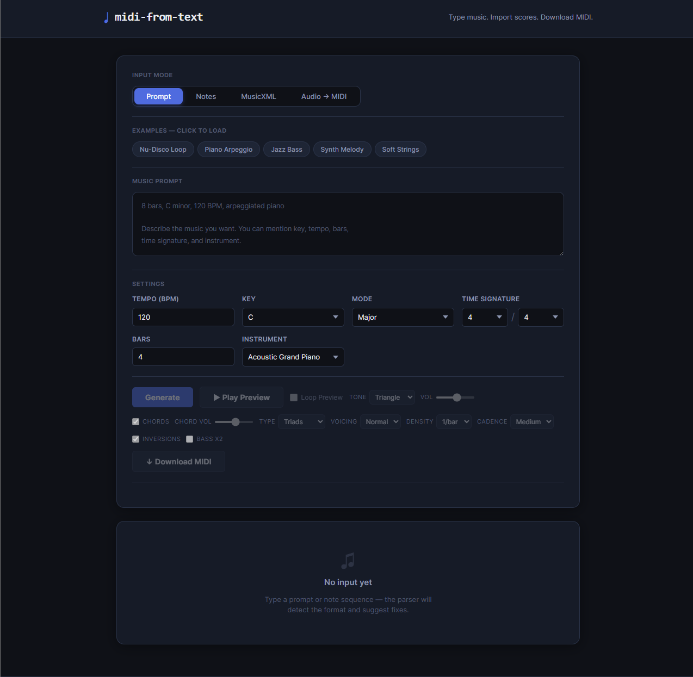
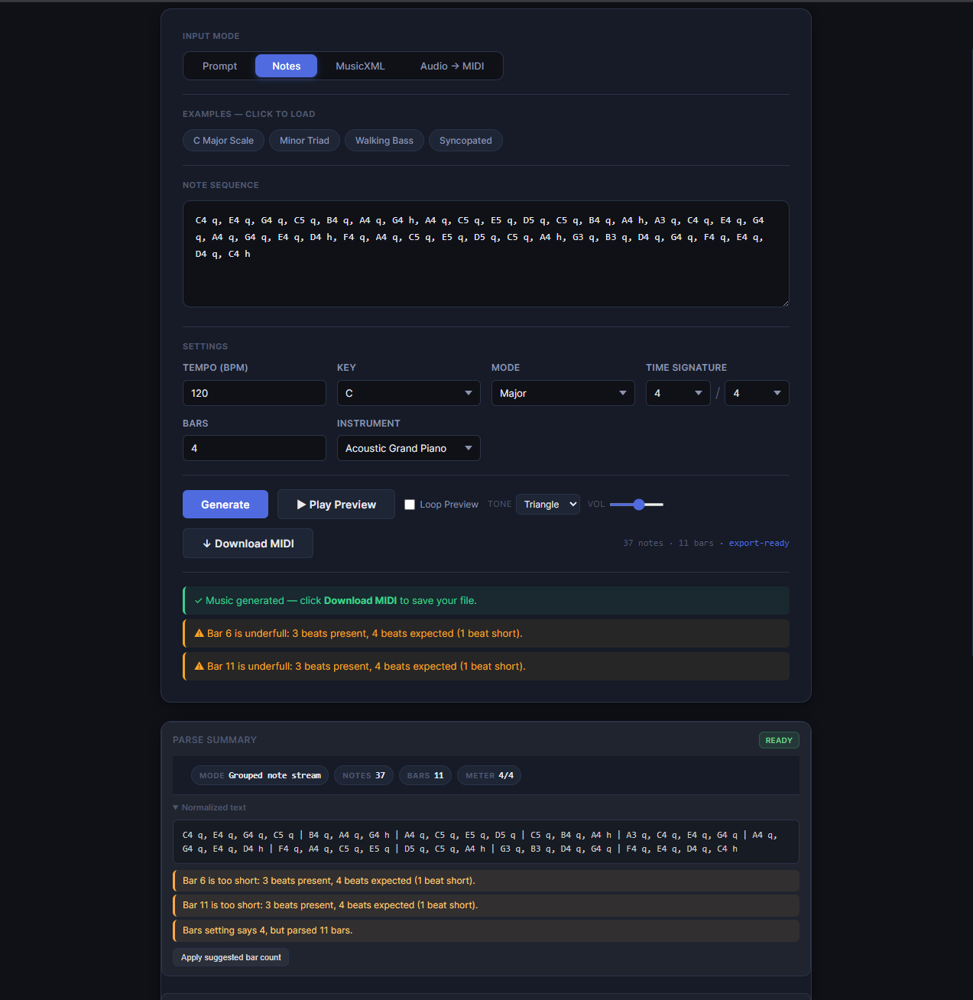
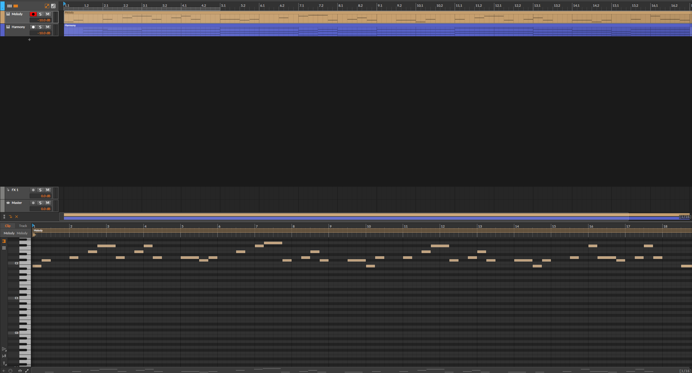
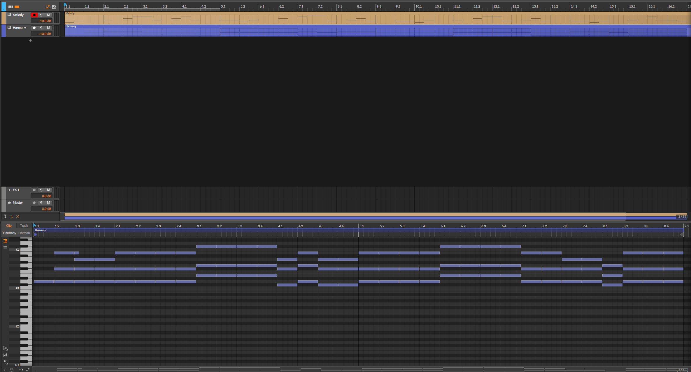

# MIDI from Text

A browser-based music sketch tool built with React, TypeScript, and Vite.

MIDI from Text lets you create simple musical ideas from either natural-language prompts or typed note input, preview them in the browser, shape the harmony, and export the result as MIDI.

## Screenshots

### Prompt mode

Describe a musical idea in plain language, set tempo/key/instrument, and generate.



### Notes mode

Type note sequences directly, preview playback, and export when ready.



### Exported MIDI — melody track

Downloaded MIDI opened in a DAW with separate melody and harmony tracks.



### Exported MIDI — harmony track

Harmony chords generated from the melody, ready for further production.



## Features

- Generate music from text prompts
- Enter melodies directly in **Notes** mode
- Preview playback in the browser
- Harmony controls for shaping the result:
  - Chord Type: Triads / Sevenths
  - Voicing
  - Inversions
  - Bass x2
  - Density: 1/bar or 2/bar
  - Cadence: Soft / Medium / Strong
- MIDI export
- Built with React + TypeScript + Vite

## Modes

### Prompt mode

Describe a musical idea in plain language and generate a melody with harmony.

Example prompts:

- `melancholic piano melody in minor key`
- `dark orchestral theme with strong cadence`
- `trippy synth loop with unstable harmony`
- `glitchy club track with heavy bass and chopped vocals`

Prompt mode works best with musically clear descriptions rather than highly abstract imagery.

### Notes mode

Type note sequences directly to test melodies, playback, and export.

Example:

```text
C4 q, E4 q, G4 q, C5 h
```

This is useful for testing exact phrases, parser behavior, and export quality.

## Harmony controls

The app includes several harmony-generation controls that let you shape the musical output.

### Generation-affecting controls

These change the actual generated harmony, so they require clicking **Generate** again:

- Chord Type
- Voicing
- Inversions
- Bass x2
- Density
- Cadence

### Playback-only controls

These do not change the generated notes, so they do **not** require regeneration:

- Chords on/off
- Chord volume
- Melody preview controls

## How it works

The app separates the music pipeline into distinct stages:

- prompt interpretation
- plan generation
- score generation
- preview playback
- MIDI export

This structure keeps the system easier to maintain and makes it safer to extend generation logic without tightly coupling everything together.

## Getting started

### Requirements

- Node.js
- npm

### Install

```bash
npm install
```

### Run in development

```bash
npm run dev
```

### Build

```bash
npm run build
```

### Lint

```bash
npm run lint
```

### Test

```bash
npm test
```

## Current status

Local checks currently pass:

- Build: passing
- Lint: passing
- Tests: 71/71 passing

## Example inputs

### Prompt examples

- `melancholic piano melody with soft strings`
- `epic orchestral cue with strong brass`
- `haunted waltz in 3/4 at 84 BPM, piano and strings`
- `dark rave theme with warped bass and sharp synths`

### Notes examples

```text
E4 q, G4 q, A4 q, B4 q, C5 h, B4 q, A4 q, G4 q, F4 q, E4 h
```

## Limitations

- Prompt mode works best with concrete musical wording
- Very abstract prompts may fail to generate a valid score
- This is a sketch tool, not a full DAW or full notation editor
- Some generated results may require regeneration after changing harmony settings

## Tech stack

- React
- TypeScript
- Vite
- Vitest
- Oxlint

## License

MIT